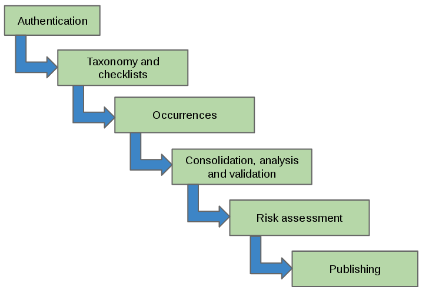
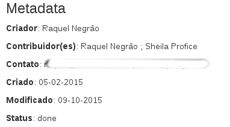
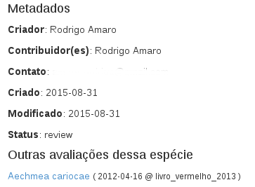
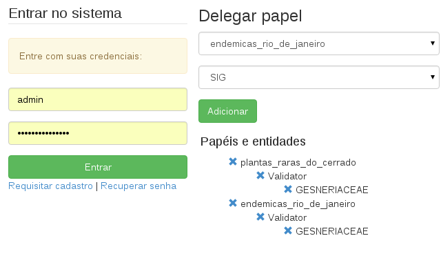
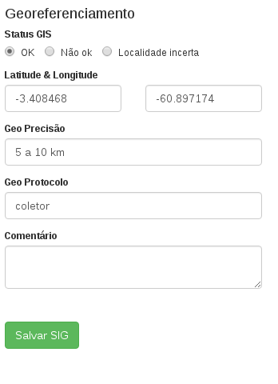
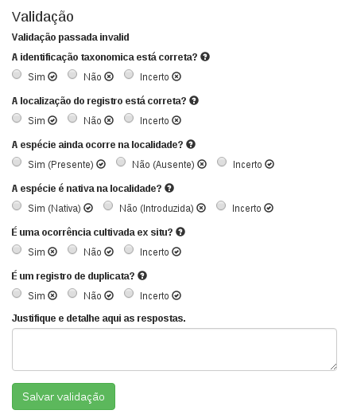
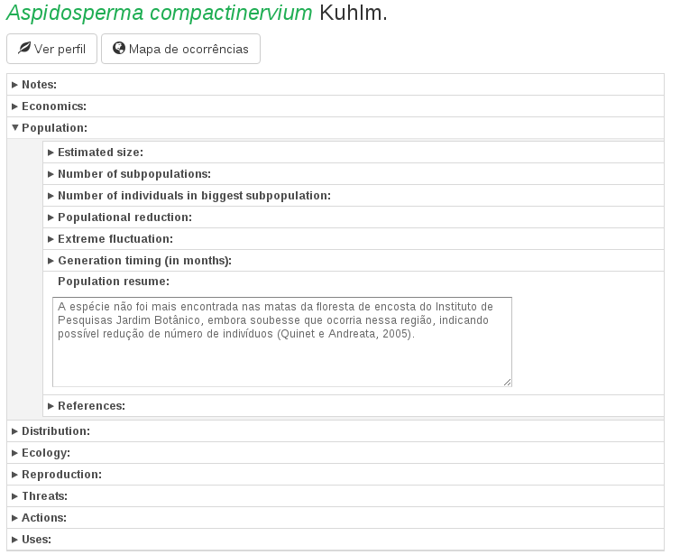
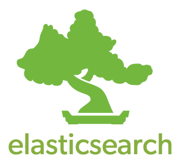

title: CNCFlora - Tools for flora conservation
output: index.html
style: style.css

--

## Tools for flora conservation

--

### Topics

* Biodiversity in Brazil
* About CNCFlora
* Our workflow
* Our data
* Our systems
* Lessons learned
* Architecture and technologies
* Whats next?

--

# Biodiversity in Brazil

## Our tools and the hard work of integration

-- logos

### Biodiversity in Brazil

 

-- logos

### Biodiversity in Brazil: Until mid 2014

 Access using Tapir or ask for data.

 Access using Tapir.

 Non existent.

 Still in development.

-- logos

### Biodiversity in Brazil: Now

 Have an IPT since last year.

 Have an IPT since this year.

 Project started last year, got an IPT.

 Still no clear way to access the data.

But can access the sources.

--

# About CNCFlora

--

### About CNCFlora

Created in 2008, started work in mid 2009, inside JBRJ.

It's main attributions:

* Manage information on species of the Brazilian flora
* Assess conservation status of these species
* Develop conservation plans for threatened species
* Coordinate ex situ conservation of the species
* Create maps of the priority areas for conservation

--

### The Workflow

* Create a team and invite specialists
* Select a group of species
* Gather data about each specie
* Analyse this data
* Validate everything
* Review validation outcome
* Assess the conservation status
* Review the assessment
* Publish

--

### The Workflow

--

# About the data

-- 

### Data types

* Taxonomy
* Occurrences
* References
* Ecology
* Distribution
* Threats
* Uses
* Actions
* Images
* Risk assessment

-- 

### Metadata

* Who: Authorship, ownership and credit.
* What: The data type.
* When: Timely scope.

At least this information is available about all data.

--

### Metadata

--

### Quality

Every information is validated by a group of specialists, and the assessment is further reviewed by trained evaluators.

--

### Documentation and history

* Everything is recorded 
* Nothing is lost
* Always keep the source
* Data changes
* Re-assessments

--

### Documentation and history

How we handle it:

* Metadata
* Versioning
* References for the field

--

### Documentation and history

--

### Documentation and history

--

### Documentation and history

-- 

# The systems

--

### A growing network of systems.

It is composed of modular (mostly) independent, replaceable parts.

--

### The systems

* Athentication
* Taxonomy service
* Checklists
* Occurrences
* Consolidation and Analysis
* Risk Assessment
* Publish
* External tools

--

### Authentication

Single Sign On solution for all the apps.

--

### Taxonomy 

Provide services based on Flora do Brasil taxonomy data.

--

### Checklist

Manage the groups of specie to work.

--

### Occurrences

Upload, insertion, preview and general work on occurrence data.

-- big

### Occurrences

Perform EOO and AOO, along with the status of the occurrences.

-- big

### Occurrences

Show information about each record.

-- height

### Occurrences

Allow to work on georeference to improve location quality.

-- height
### Occurrences

And validation by the specialists on taxonomy, presence, position and others.

-- big

### Consolidation and Analysis

Consolidation, analysis and validation of general data.

-- big

### Risk Assessment

Assessment, review and finalization of risk assessment.

--

### Publishing

Names and categories in IPT

-- big

### Publishing

Data is also on a webservice.

-- big

### Publishing

Also in the portal, consuming from the webservice.

-- big

### Publishing

And we are working on better reports on CKAN.

--

### External tools

Also some auxillary tools:

* Mendeley
* Google Earth
* QGis
* GeoNode

--

# Lessons learned

--

### The hard parts

* User experience (interface)
* Ever changing taxonomy
* Data availability
* Data quality
* Feedback to the sources

--

### About Interoperability

* Build with, do not build on
* Integrate with, but do not deppend on
* Use a middleware
* Use what is available
* Keep it simple

--

# Architecture and Technology 

--

### Microservices

As Martin Fowler puts it:

"(...) a particular way of designing software applications as suites of independently deployable services."

-- med

### Persistence

 

A schemaless restful document database and a great index and search system.

-- logos

### Languages

 

Ruby, Clojure and PHP.

-- med

### DevOps

 

--

# Whats next?

--

### Next

* Publish more reports
* Occurrence gathering
* Apply automatic quality functions on occurrences
* Integrate more data from Flora do Brasil
* Alert when relevant data changes

--

# Thank you!
## The end.

